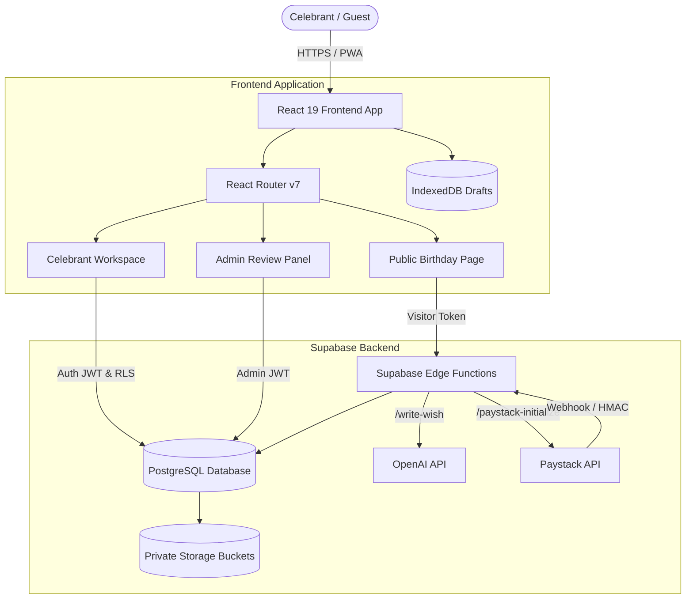

<div align="center">


### One Link for Your Birthday Wishes, Wishlist, and Gifts 🎈

[](https://opensource.org/licenses/MIT)
[](https://react.dev/)
[](https://www.typescriptlang.org/)
[](https://vitejs.dev/)
[](https://supabase.com/)
[](https://web.dev/progressive-web-apps/)

[Features](#-key-features) • [Tech Stack](#-tech-stack) • [Architecture](#-system-architecture) • [Getting Started](#-getting-started) • [Supabase & Backend](#-backend--database-setup) • [Deployment](#-deployment)

</div>

---

## 🌟 Overview

**Huraay** is a celebration-first birthday SaaS platform crafted to replace chaotic WhatsApp statuses, fleeting Instagram stories, and lost birthday messages. 

With Huraay, celebrants create a single, beautifully personalized **Birthday Page** to collect heartfelt wishes on an interactive Wish Wall, reveal a curated wishlist, and securely receive cash gifts or bank transfers with automatic receipt validation.

---

## ✨ Key Features

### 🎂 Personalized Birthday Pages
- **Custom Vanity URLs & Themes**: Choose from vibrant themes (*Classic Purple*, *Pink Sparkle*, *Champagne Luxe*, *Midnight Spark*, *Emerald Glow*, *Sunset Warmth*).
- **Framed Photo Galleries**: Built-in interactive photo cropper with zoom, 4:5 aspect ratio framing, pan controls, and metadata-stripping WebP compression.
- **Celebration Countdowns**: Dynamic real-time countdown to the celebrant's birthday with confetti celebrations.

### 💌 Interactive Wish Wall & AI Wish Assistant
- **Live Celebration Motion**: Dynamic particle effects, confetti bursts, and animated wish arrival cards.
- **Public & Private Messages**: Guests can choose to share their love publicly on the wall or privately with the celebrant only.
- **AI-Powered Wish Composer**: Integrated OpenAI-powered assistant (`/write-wish` edge function) to help guests write touching, witty, or poetic birthday messages.
- **Draft Preservation**: Local draft autosaving in IndexedDB protects against unexpected network loss.

### 🔒 Protected Wishlist & "Wish-to-Unlock" Gate
- **Gated Access**: Wishlist items, bank account numbers, and WhatsApp numbers are locked behind a cryptographic wish gate.
- **Server-Verified Unlocks**: Submitting a valid birthday wish generates a cryptographically secure, page-specific token validated via SHA-256 hashes on protected endpoints.

### 💳 Birthday Cash Gifts & Transfer Receipts
- **One-Click Bank Details**: celebrants can securely publish account numbers and bank names.
- **Transfer Receipt Upload**: Guests can attach PDF or image proof of transfer directly to the celebration page.
- **Private Storage**: Receipts are stored in isolated, access-controlled Supabase storage buckets (`birthday-transfer-receipts`) and accessible only to page owners via short-lived signed URLs.

### 🛠️ Celebrant Workspace & Analytics
- **Live Moderation**: Real-time moderation tools to publish, hide, restore, or permanently remove wishes.
- **Wishlist Tracking**: Mark items as fulfilled, archive, or manage external store purchase links.
- **Pro Analytics Funnel**: Comprehensive traffic metrics tracking page views, unique visitors, wishlist unlocks, gift clicks, bank copies, and WhatsApp intents.

### 💎 Pro Upgrade Tier & Payments
- **Flexible Plans**: Generous Free tier alongside a lifetime Pro tier (`₦2,000` one-time).
- **Paystack Integration**: Automated checkout with server-side HMAC-SHA512 webhook signature verification.
- **Manual Bank Transfer Flow**: Manual payment verification flow with receipt submission and dedicated administrative review queue.

### 📱 Installable Progressive Web App (PWA)
- **Mobile-First Experience**: Ultra-responsive layout optimized down to 320px screens.
- **Installable App**: Includes web app manifest, offline service worker caching, and native app styling.
- **Accessibility & Motion Controls**: Full support for OS `prefers-reduced-motion` settings.

---

## 🛠 Tech Stack

| Layer | Technologies |
|---|---|
| **Frontend Framework** | [React 19](https://react.dev/), [TypeScript 5.8](https://www.typescriptlang.org/), [React Router v7](https://reactrouter.com/) |
| **Styling & UI** | Custom Vanilla CSS Design System (`#6223CF` Purple, `#EE3A84` Pink), [Motion](https://motion.dev/), [Phosphor Icons](https://phosphoricons.com/) |
| **Build & Tooling** | [Vite 7](https://vitejs.dev/), [Vite PWA Plugin](https://vite-pwa-org.netlify.app/), [Vitest](https://vitest.dev/), [ESLint](https://eslint.org/) |
| **Backend & Storage** | [Supabase](https://supabase.com/) (PostgreSQL 15+, Row Level Security, Realtime Publications, Private Storage Buckets) |
| **Serverless Functions** | Supabase Edge Functions (Deno runtime, TypeScript) |
| **AI Integration** | OpenAI API (`gpt-5-mini` / customized model) for intelligent wish generation |
| **Payments** | [Paystack](https://paystack.com/) (NGN) & Manual Bank Transfer workflow |

---

## 📐 System Architecture



---

## 📁 Repository Structure

```text
Huraay/
├── public/                     # Static assets, PWA icons, web manifest
├── src/
│   ├── components/             # Reusable UI components (Dialogs, Select, DatePicker, Celebration, etc.)
│   ├── data/                   # Design system tokens and static definitions
│   ├── lib/                    # Supabase client, Auth context, API handlers, media utilities
│   ├── pages/                  # Route views (HomePage, BoardEditorPage, PublicBoardPage, WorkspacePage, etc.)
│   ├── styles.css              # Core responsive design system and celebration animations
│   ├── types.ts                # Global TypeScript domain definitions
│   ├── App.tsx                 # Route declarations, providers, and layout structure
│   └── main.tsx                # Client bootstrap and PWA registration
├── supabase/
│   ├── functions/              # 11 Serverless Deno Edge Functions
│   │   ├── admin-payments/
│   │   ├── paystack-initialize/
│   │   ├── paystack-webhook/
│   │   ├── protected-wishlist/
│   │   ├── public-page/
│   │   ├── record-page-event/
│   │   ├── review-manual-payment/
│   │   ├── submit-birthday-transfer-receipt/
│   │   ├── submit-birthday-wish/
│   │   ├── submit-manual-payment/
│   │   └── write-wish/
│   ├── migrations/             # Idempotent PostgreSQL migrations with RLS policies
│   └── config.toml             # Supabase local and remote configuration
├── tests/                      # Security contract tests & media processing unit tests
├── INTEGRATION_GUIDE.md        # Comprehensive operations & secrets configuration guide
├── PROJECT_SUMMARY.md          # Architectural history & implementation changelog
├── package.json
├── vite.config.ts
└── vitest.config.ts
```

---

## 🚀 Getting Started

### Prerequisites
- **Node.js**: `v18.0.0` or higher
- **npm**: `v9.0.0` or higher
- **Supabase CLI** (optional for local functions/migrations development)

### 1. Clone & Install
```bash
git clone https://github.com/AbrahamOyo-Ita/Huraay.git
cd Huraay
npm install
```

### 2. Configure Environment Variables
Create a `.env` file in the project root based on `.env.example`:

```env
# Supabase Configuration
VITE_SUPABASE_URL="https://YOUR_PROJECT_REF.supabase.co"
VITE_SUPABASE_PUBLISHABLE_KEY="YOUR_SUPABASE_ANON_KEY"

# AI Wish Generator Endpoint (Supabase Edge Function)
VITE_AI_ENDPOINT="https://YOUR_PROJECT_REF.supabase.co/functions/v1/write-wish"

# Application URL
VITE_APP_URL="http://localhost:5173"

# Optional: Business Bank Account for Manual Pro Transfers
VITE_BUSINESS_BANK_NAME="Your Bank Name"
VITE_BUSINESS_ACCOUNT_NUMBER="0123456789"
VITE_BUSINESS_ACCOUNT_NAME="Huraay Technologies"
```

### 3. Run Development Server
```bash
npm run dev
```
Open [http://localhost:5173](http://localhost:5173) in your browser.

---

## 🔐 Backend & Database Setup

### 1. Database Migrations
Apply the PostgreSQL migrations using the Supabase CLI:
```bash
npx supabase link --project-ref YOUR_PROJECT_REF
npx supabase db push
```

### 2. Edge Function Secrets
Set the required server-side secrets in your Supabase project:
```bash
npx supabase secrets set \
  APP_ORIGIN="https://huraay.com" \
  OPENAI_API_KEY="sk-..." \
  OPENAI_MODEL="gpt-5-mini" \
  PAYSTACK_SECRET_KEY="sk_live_..." \
  RATE_LIMIT_SALT="random_cryptographic_salt"
```

### 3. Deploy Edge Functions
```bash
npx supabase functions deploy --all
```

### 4. Promote Administrator (Optional)
To grant an account admin privileges for manual payment review:
```sql
INSERT INTO public.user_roles (user_id, role)
VALUES ('YOUR_AUTH_USER_UUID', 'admin')
ON CONFLICT DO NOTHING;
```

---

## 🧪 Available Scripts

| Script | Description |
|---|---|
| `npm run dev` | Starts the Vite local development server |
| `npm run build` | Runs type checks and creates an optimized production PWA build in `/dist` |
| `npm run typecheck` | Validates TypeScript types across the entire project |
| `npm test` | Runs the test suite via Vitest |
| `npm run lint` | Lints the codebase with ESLint |

---

## 🛡️ Security Architecture

- **Row Level Security (RLS)**: Strictly limits read/write access so celebrants can only modify their own boards, wishes, and media.
- **Private Storage**: Buckets (`birthday-media`, `wishlist-media`, `transfer-receipts`) disallow direct public reads; assets are delivered via short-lived signed URLs.
- **Abuse Prevention**: Wish submission includes honeypot inputs, minimum submission timing thresholds, and salted IP rate-limiting.
- **Content Security Policy (CSP)**: Hardened CSP avoiding `unsafe-eval` with clickjacking and MIME-sniffing protections configured in `vercel.json` and `netlify.toml`.

---

## 🚀 Deployment

The project is pre-configured for instant zero-configuration deployment to **Vercel** and **Netlify**:

- **Vercel**: Includes `vercel.json` with SPA route rewrites, immutable caching headers for static assets, and security headers.
- **Netlify**: Includes `netlify.toml` with publish rules and redirect handling.

Make sure to set all `VITE_*` environment variables in your hosting provider's dashboard prior to building.

---

## 📄 License

This project is licensed under the [MIT License](LICENSE).
